# 이리오너라(Irioneora)


## 1️⃣ 프로젝트 소개

1. 일정 : 2021-08-30 ~ 2021-10-08 (총 6주)
   - Sub1 : 2021-08-30 ~ 2021-09-03
   - Sub2 : 2021-09-06 ~ 2021-09-17
   - Sub3 : 2021-09-20 ~ 2021-10-08 
   
   
   
2. 인원 (총 4인)

   

   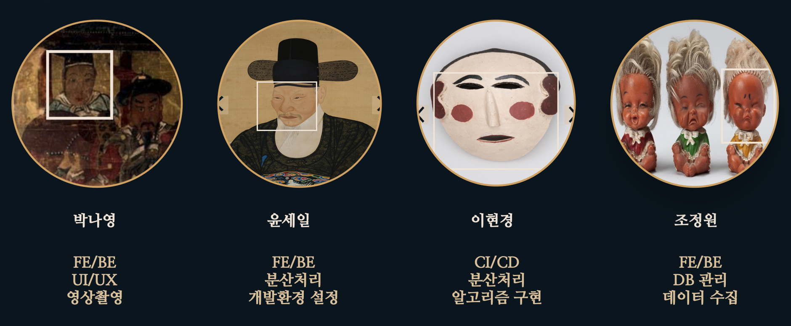

<br><br>

## 📋 기술 스택

- SCM 
  - 
- Issue 
  - 
- Communication 
  - 
- Design/UI/UX :
  - 
  - 

<br>

- DB
  - 
- Cloud
  - 
  - 
  - 
  - 

<br>

**Back-End**

  - 
  - 
  - 

<br>

**Hadoop**

- 
- 

<br>

**Front-End**

  - 
  - 
  - 
  - 
  - 
  - 

<br>


## 기획의도 

#### 1. 우리 문화재에 대한 접근성 높이기 

​		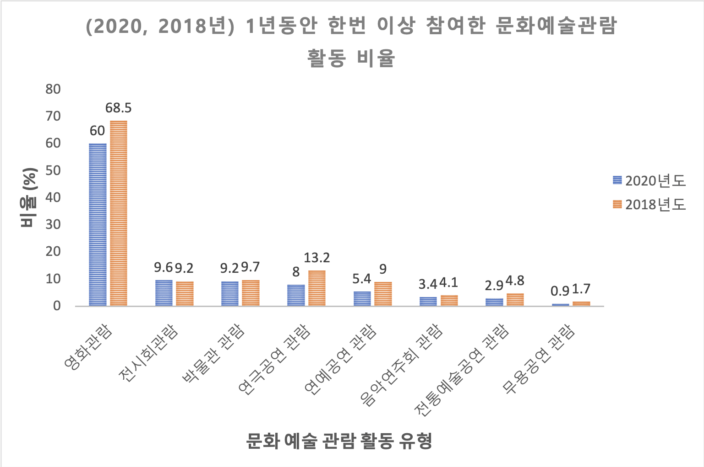 

- 우리나라 문화재와 유물의 매력을 손쉽게 접할 수 있는 서비스 제공

<br>

#### 2. MZ세대의 흥미에 맞춘 테스트 서비스

-  유저들의 흥미를 유발하기 위하여 사용자가 직접 참여하는 테스트를 기획

<br>

<br>

## 프로젝트 아키텍처 

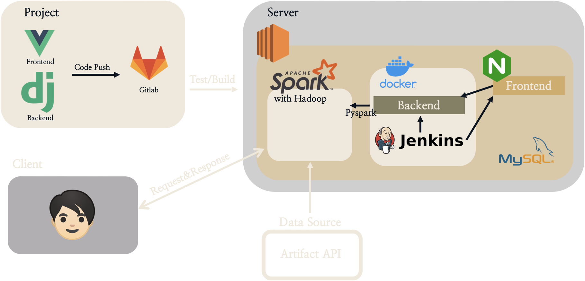 

<br>

<br>

## 분산처리 (Hadoop) 구조

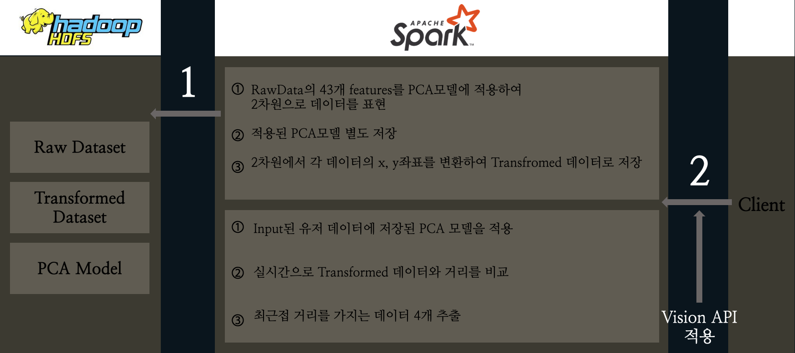 


<br><br>

## 향후 발전 가능성 및 의의 

- 현재 EC2 서버에서 분산처리를 수행하고있으나, 대규모 클러스터를 연결하여 다수의 사용자가 이용할 수 있도록 개선시킬 예정
- 국/공립 박물관과의 서비스 연계 등을 통하여 우리나라 유물과 전통 전반을 소개하는 서비스로 발전 가능 

<br>

<br>

## 🎨 디자인

#### MAIN PAGE

.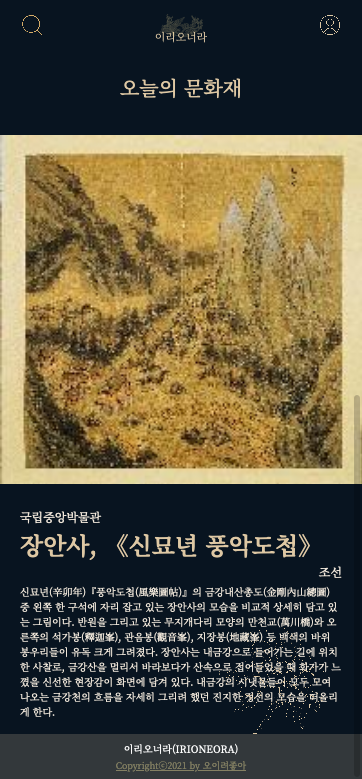 

<br>

#### RESULT PAGE

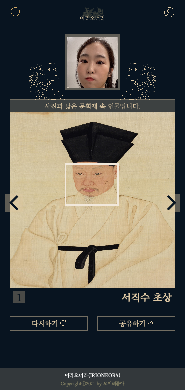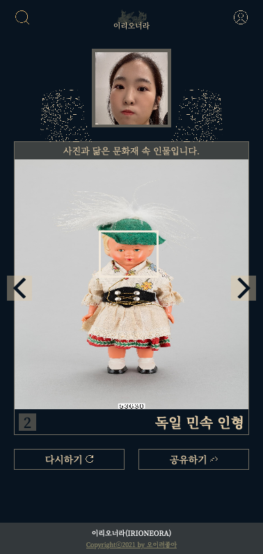 

<br>

#### DETAIL PAGE

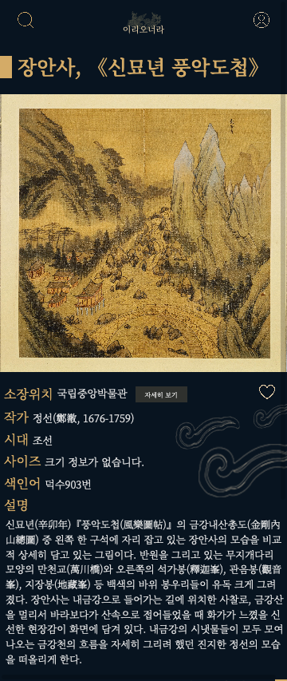 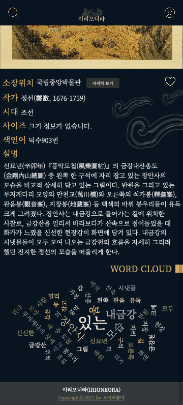 

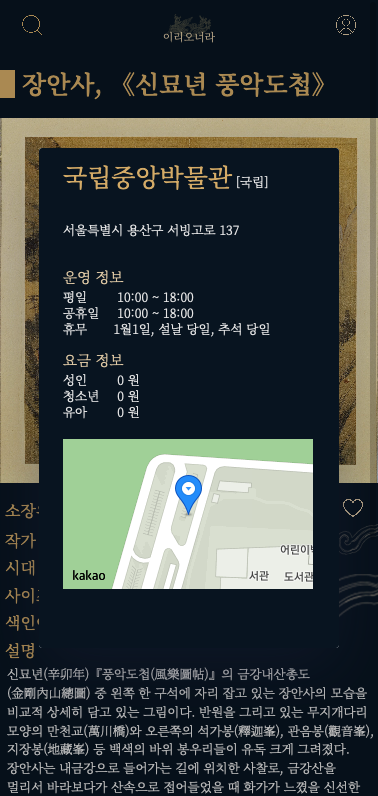 

<br>

#### SEARCH PAGE

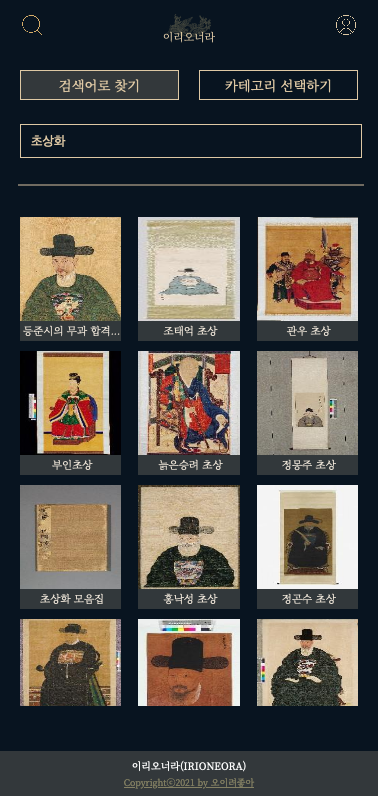 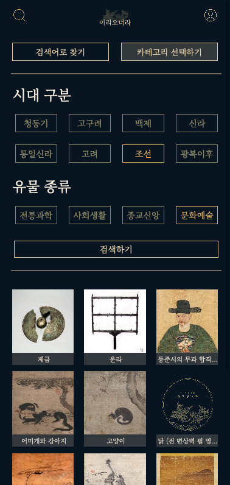 

<br>

#### LOGIN & SIGNUP PAGE  

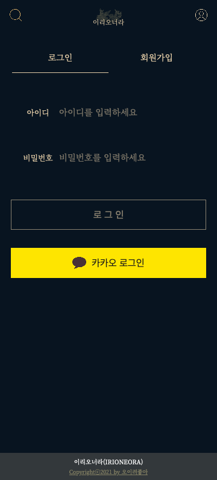 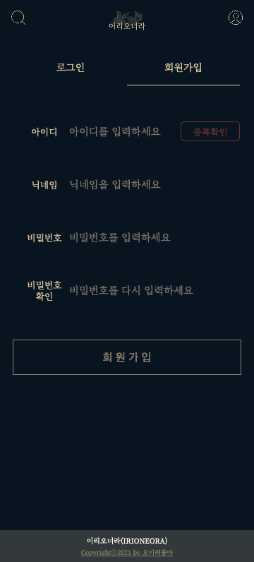 

<br>

#### PROFILE PAGE

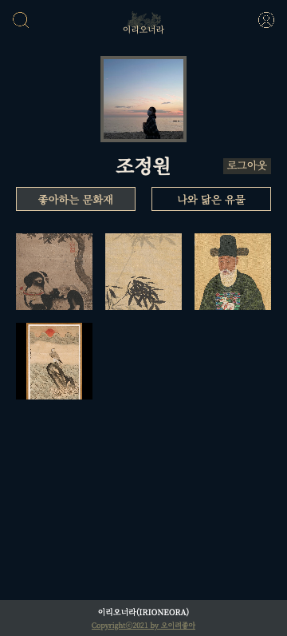 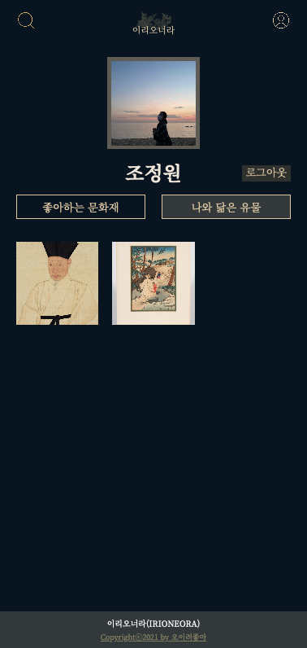 


<br>

## 2️⃣ 프로젝트 파일 구조

### Back

```
backend
│  
│  manage.py
│  README.md
│  requirements.txt
│  
├─accounts
│  │  adapter.py
│  │  admin.py
│  │  apps.py
│  │  models.py
│  │  serializers.py
│  │  tests.py
│  │  urls.py
│  │  views.py
│  │  __init__.py
│  │  
│  └─migrations
│          
├─artifacts
│  │  admin.py
│  │  apps.py
│  │  models.py
│  │  serializers.py
│  │  tests.py
│  │  urls.py
│  │  views.py
│  │  __init__.py
│  │  
│  └─migrations
│          
├─irioneora
│      asgi.py
│      mysql_settings.py
│      settings.py
│      urls.py
│      wsgi.py
│      __init__.py
│      
├─pages
│  │  admin.py
│  │  apps.py
│  │  models.py
│  │  serializers.py
│  │  tests.py
│  │  urls.py
│  │  views.py
│  │  __init__.py
│  │  
│  └─migrations
│          
├─scripts
│  │  get_vision_data.py
│  │  storing_data.py
│  │  storing_vision_data.py
│  └─ __init__.py
│          
└─spark
    │  admin.py
    │  apps.py
    │  models.py
    │  tests.py
    │  urls.py
    │  views.py
    │  __init__.py
    │  
    ├─migrations
    │      
    └─model
        ├─data
        │      part-00000-a1604de1-63fa-4947-8f13-325cb7ba07d9-c000.snappy.parquet
        │      _SUCCESS
        │      
        └─metadata
                part-00000
                _SUCCESS
```

### Front

```
frontend
│  
│  babel.config.js
│  extt.txt
│  package-lock.json
│  package.json
│  README.md
│  vue.config.js
│  webpack.config.js
│  
├─public
│      favicon.ico
│      index.html
│      logo-navbar.png
│      
└─src
    │  App.vue
    │  main.js
    │  
    ├─api
    │      accounts.js
    │      artifacts.js
    │      kakao.js
    │      
    ├─assets
    │  │  logo.png
    │  │  
    │  ├─images
    │  │      detailpage-cloud.png
    │  │      heart-empty.png
    │  │      heart.png
    │  │      kakao-icon.png
    │  │      kakao-login-wide.png
    │  │      left-m.png
    │  │      logo-main.png
    │  │      logo-navbar.png
    │  │      logo-transparent.png
    │  │      mainpage-flower.png
    │  │      mainpage.png
    │  │      middle-m.png
    │  │      nav-search.png
    │  │      profile-background.png
    │  │      profile-transparent.png
    │  │      result-replay.png
    │  │      result-share.png
    │  │      resultpage-face-left.png
    │  │      resultpage-face-right.png
    │  │      resultpage.png
    │  │      right-m.png
    │  │      right-mountain2.png
    │  │      
    │  └─style
    │      ├─accounts
    │      │      Login.scss
    │      │      profile-sub.scss
    │      │      profile.scss
    │      │      sign-in-up.scss
    │      │      signup.scss
    │      │      _image-box.scss
    │      │      _kakao-login.scss
    │      │      
    │      ├─artifacts
    │      │      detail.scss
    │      │      museum.scss
    │      │      result.scss
    │      │      _card-thumbnail.scss
    │      │      _error-modal.scss
    │      │      _icon-button.scss
    │      │      _result-box.scss
    │      │      _search-box.scss
    │      │      _search-card.scss
    │      │      _search-filter.scss
    │      │      _search-filterpage.scss
    │      │      _search-page.scss
    │      │      _todays-artifact.scss
    │      │      
    │      └─common
    │              button.scss
    │              Error.scss
    │              Loading.scss
    │              main.scss
    │              NavBar.scss
    │              
    ├─components
    │  │  
    │  ├─accounts
    │  │      ImageBox.vue
    │  │      KakaoLogin.vue
    │  │      UserInput.vue
    │  │      
    │  ├─artifacts
    │  │      CardThumbnail.vue
    │  │      ErrorModal.vue
    │  │      IconButton.vue
    │  │      ImageInput.vue
    │  │      MuseumModal.vue
    │  │      ReseultPreview.vue
    │  │      ResultBox.vue
    │  │      SearchBox.vue
    │  │      SearchCard.vue
    │  │      SearchFilter.vue
    │  │      TodaysArtifact.vue
    │  │      
    │  └─common
    │          Button.vue
    │          Loading.vue
    │          LowBar.vue
    │          NavBar.vue
    │          
    ├─router
    │      index.js
    │      
    ├─store
    │  │  index.js
    │  │  
    │  └─modules
    │          accounts.js
    │          artifacts.js
    │          
    └─views
        ├─accounts
        │      LoginPage.vue
        │      ProfileLikePage.vue
        │      ProfilePage.vue
        │      ProfileResemblePage.vue
        │      SignInUpPage.vue
        │      SignupPage.vue
        │      
        ├─artifacts
        │      DetailPage.vue
        │      ResultPage.vue
        │      SearchFilterPage.vue
        │      SearchIndexPage.vue
        │      SearchPage.vue
        │      
        └─common
                ErrorPage.vue
                LoadingPage.vue
                MainPage.vue        

```

